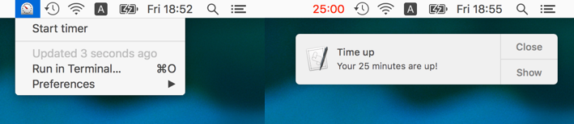

### A simple Pomodoro timer bit-bar plugin
This is a simple [BitBar](https://github.com/matryer/bitbar) plugin written in Perl. It allows you to set a 25 minute timer and once it finishes, you get a little Notification Center badge.

To use, just drop it into your BitBar plugins folder and refresh.
